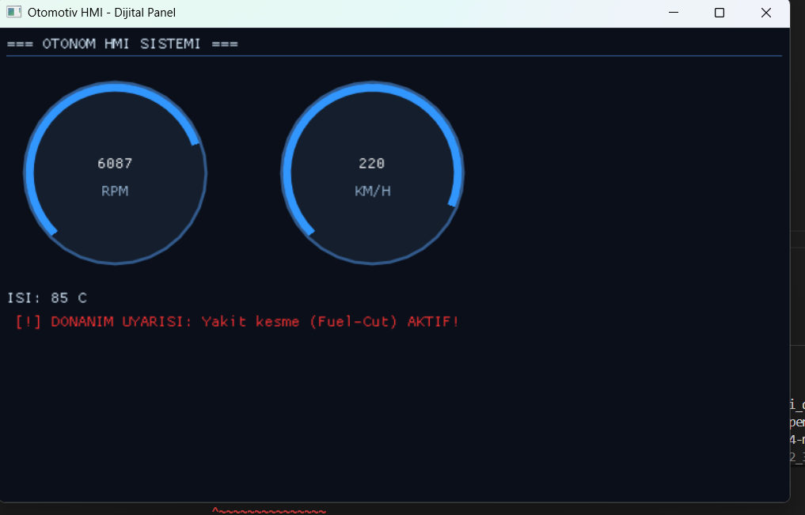

# 🚗 Automotive ECU CAN-BUS Decoder & HMI Digital Dashboard

A real-time **Human-Machine Interface (HMI)** and **CAN-Bus Data Decoder** simulation system developed using modern C++ (C++20), **SDL2**, and **Dear ImGui**. This software parses raw CAN data packets from an ECU and visualizes them on a digital dashboard (RPM, Speed, Temperature, and Hardware Warnings).

## 📸 Screenshot

<div align="center">
  
</div>

---

## 🚀 Features

* **Real-Time CAN Data Processing:** Reads ECU data to dynamically decode vehicle parameters.
* **Modern Vector HMI Interface:** Clean, hardware-accelerated digital gauges powered by ImGui.
* **Safety & Warning Systems:** Dynamic *Fuel-Cut* warning mechanism triggered when RPM thresholds are exceeded.
* **Cross-Platform Support:** High-performance SDL2 & OpenGL integration for Windows and Linux environments.

---

## 🛠️ Technologies Used

* **Language:** C++20
* **GUI Library:** Dear ImGui
* **Window & Graphics Management:** SDL2 & OpenGL
* **Compiler:** MinGW-w64 (GCC / UCRT)

---

## ⚙️ Installation & Building (Windows / MinGW)

Follow these steps to build the project locally on your machine:

1. Clone the repository:
   ```bash
   git clone [https://github.com/YOUR_USERNAME/canbusdecooder.git](https://github.com/YOUR_USERNAME/canbusdecooder.git)
   cd canbusdecooder